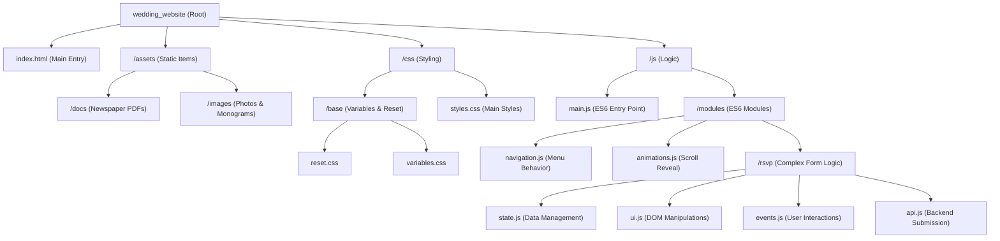

# Wedding Website Architecture Overview

This document outlines the architectural structure and functional design of the wedding website. The project has been effectively refactored to prioritize modularity, separation of concerns, and clean ES6 module imports, moving away from relying on monolithic script files.

## 📂 Folder Structure

The application's file layout follows a logical separation of assets, styling, and modular JavaScript functionality.

---

## ⚙️ Functional Blueprint

The website acts as a static Single Page Application (SPA), dynamically displaying content through a combination of CSS animations and JavaScript Intersection Observers. Functionality is entirely localized on the client side using ES6 modules.

### 1. Main Entry (`main.js`)
Serves as the central bootstrapper for the application that is loaded into `index.html` via ``. Upon `DOMContentLoaded`, it initializes navigation scripts, loads scroll animations, and delegates RSVP form initiation to its respective modules.

### 2. General UX Modules
- **`navigation.js`**: Controls the mobile hamburger menu toggle and observes window scrolling to apply an "active" class to navbar links dynamically based on the current `<section>` in the viewport.
- **`animations.js`**: Sets up an `IntersectionObserver` to trigger fade-ins and slide-ups (`.slide-up`) for elements entering the viewport, ensuring a fluid visual experience.

### 3. The RSVP Component Workflow
The RSVP feature is the most functionally intricate component, managing a complex multi-step UI flow. It operates based on a **finite state machine** architecture distributed across four files:

*   **`state.js`**: Holds the single source of truth for the active form (`rsvpState`). It tracks the current step phase, overall form properties (full name, email, dietary notes), dynamic arrays for guest names per event, and whether the form has successfully submitted.
*   **`ui.js`**: Responsible exclusively for DOM reactivity. Based on `rsvpState`, it handles showing/hiding form steps, updating progress bar lengths, conditionally restricting button states (e.g., locking the "Next" button on Step 1 until a name is typed), and dynamically rendering guest name input fields based on requested quantities.
*   **`events.js`**: The controller block. It binds to user activity (typing in inputs, selecting attendance radio buttons, modifying the guest counter buttons `+` and `-`). Every dispatch updates the values in `state.js` and immediately triggers `updateView()` from `ui.js` to reconcile the DOM.
*   **`api.js`**: Isolates side-effects and external communication. It receives the packaged `formData` JSON map on completion and signals when async submissions finish, resulting in the final success screen overlay rendering.

### 4. Modular Separation
All site functionality is now fully decoupled into specialized modules. This ensures that styling (`ui.js`), state management (`state.js`), and user interaction (`events.js`) can be modified independently without risk of side effects across the entire application.

## 🛠️ Important: Running the Project Locally

Because we upgraded your JavaScript to use modern `<script type="module">`, **you can no longer simply open `index.html` by double-clicking it**. Browsers have strict security (CORS) that blocks ES modules from loading over the local `file:///` protocol.

> [!IMPORTANT]
> You must now serve the site over `http://localhost`. The absolute easiest way to do this is using the **Live Server** extension in VS Code.

### How to install and use Live Server:
1. Open Visual Studio Code.
2. Click on the **Extensions** icon on the left sidebar (or press `Ctrl+Shift+X`).
3. Search for **"Live Server"** (the author is *Ritwick Dey*).
4. Click **Install**.
5. Once installed, simply open your `index.html` file in VS Code.
6. Look at the bottom right corner of your VS Code window (in the blue status bar) and click **"Go Live"**.
7. Your browser will automatically pop open at `http://127.0.0.1:5500/index.html` and the site will load perfectly!

> [!TIP]
> As an added bonus, "Live Server" automatically refreshes your browser every time you hit Save in your CSS or HTML! No more manual F5 refreshing!
